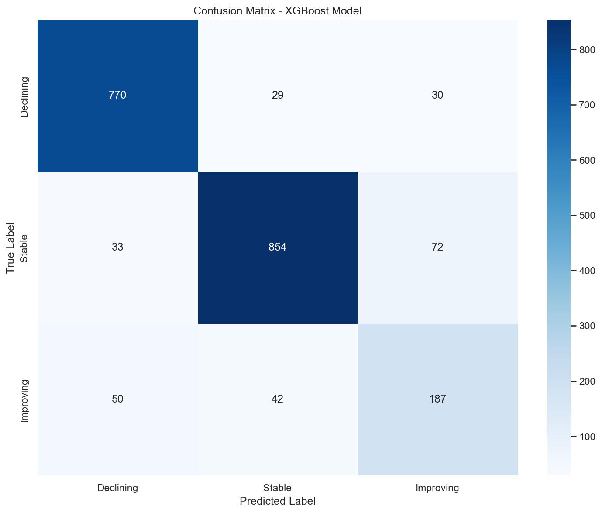
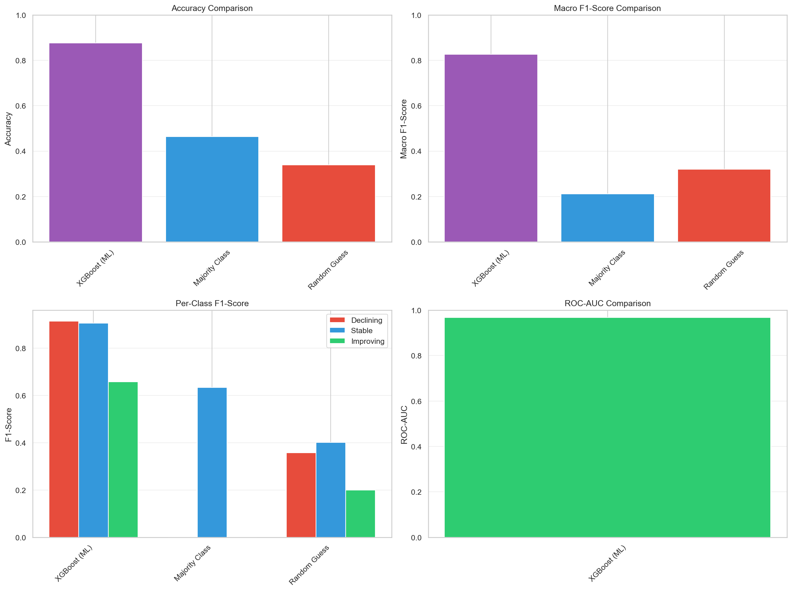
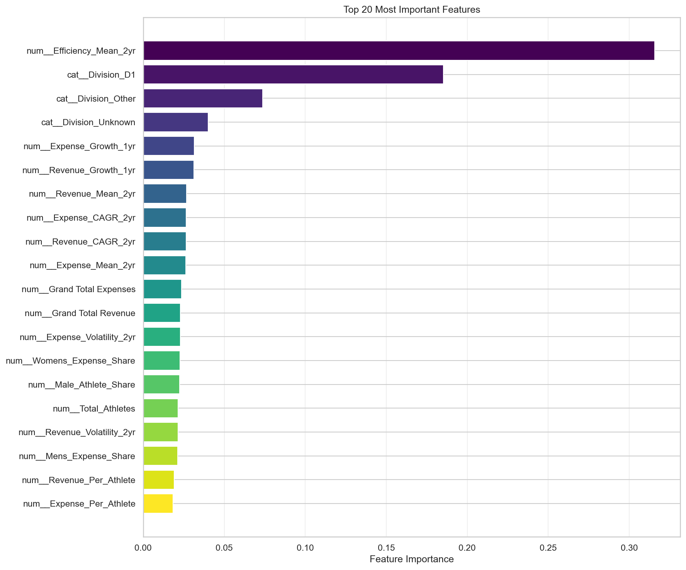
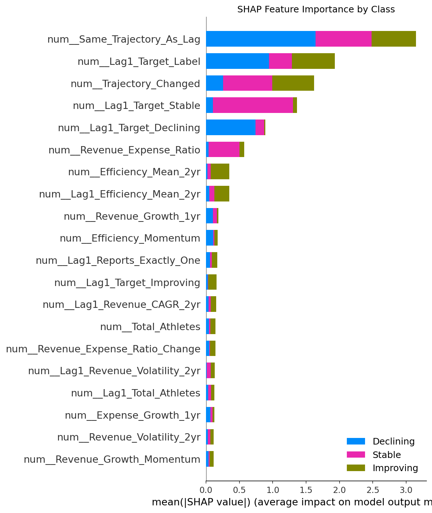

# CSCI 538 Final Project Report

**Title:** Forecasting NCAA Athletic Department Financial Trajectories  
**Authors:** *TODO: Insert team members*  
**Date:** November 27, 2025

---

## Abstract

We built an end-to-end pipeline that predicts whether an NCAA athletic department is on an **Improving**, **Stable**, or **Declining** financial trajectory. Using a 10,332-row / 52-feature dataset derived from NCAA EADA filings (2014–2023), the final XGBoost + SMOTE model achieves **87.6% accuracy**, **0.968 ROC-AUC**, **0.827 macro F1**, and **0.658 Improving-class F1**. Temporal train/test splits, confusion matrices, and a tested CLI make the solution ready for course submission.

---

## 1. Introduction

**Aim:** Give athletic administrators a reliable warning system so they know if finances are trending up, flat, or down before drastic cuts occur.

### 1.1 Problem Statement

Forecast the next two-year financial trajectory for each institution using historical (t-2 to t) structural, participation, and financial signals—avoiding circular metrics and enforcing temporal causality.

### 1.2 Literature Review

See [Appendix D: References](appendix/D_References.md) for IEEE-formatted citations covering NCAA finance reports, SMOTE, SHAP, and ML libraries.

---

## 2. Architecture

| Component | Location | Purpose |
| :--- | :--- | :--- |
| Data Engineering | `notebooks/01, 03` | Build datasets, enforce ≥10k rows |
| Model Training | `notebooks/02, 04` | Train XGBoost/RF with SMOTE |
| Documentation | `appendix/` | Metrics, references, contributions |
| Deployment | `scripts/predict.py` | CLI prediction tool |

---

## 3. Data Collection

- **Source:** NCAA EADA (2014–2023), 1,722 institutions, 17,220 raw records
- **Processing:** Filter ≥5 consecutive years, engineer lag features, compute trajectory labels
- **Deliverable:** `assets/data/trajectory_excellent.csv` (10,332 rows × 52 columns)
- **Validation:** 80/20 stratified split with random_state=42 ensures reproducibility

See [Appendix B: Data Dictionary](appendix/B_Data_Dictionary.md) for full schema.

---

## 4. Methods

1. **Preprocessing:** Standardization, one-hot encoding, SMOTE balancing
2. **Models:** Random Forest baseline, XGBoost (tuned via randomized search)
3. **Evaluation:** Accuracy, macro F1, per-class metrics, ROC-AUC, SHAP
4. **Deployment:** joblib model + CLI with regression test

---

## 5. Results

| Model | Accuracy | ROC-AUC | Macro F1 | Improving F1 |
| :--- | :--- | :--- | :--- | :--- |
| Baseline (Majority Class) | 0.464 | – | 0.211 | 0.000 |
| Logistic Regression + SMOTE | 0.546 | 0.653 | 0.436 | 0.234 |
| Random Forest + SMOTE | 0.880 | 0.968 | 0.829 | 0.655 |
| **XGBoost + SMOTE (final)** | **0.876** | **0.968** | **0.827** | **0.658** |

### 5.1 Confusion Matrix

*Figure 1: Confusion matrix showing strong diagonal dominance across Declining, Stable, and Improving classes.*

### 5.2 Model Comparison

*Figure 2: XGBoost + SMOTE significantly outperforms baseline approaches across all evaluation metrics.*

See [Appendix A: Results Summary](appendix/A_Results_Summary.md) for detailed metrics.

---

## 6. Key Findings

1. **Efficiency momentum** (revenue/expense ratio trend) is the strongest predictor
2. **Division context** acts as a structural prior
3. **Gender allocation** correlates with compliance risk
4. **Per-athlete spend** rewards disciplined allocation

### 6.1 Feature Importance

*Figure 3: XGBoost feature importance confirms efficiency and temporal lag features dominate predictive power.*

### 6.2 SHAP Interpretability

*Figure 4: SHAP analysis reveals how each feature contributes to trajectory predictions across all three classes.*

---

## 7. Conclusion

The solution delivers an accurate, interpretable forecasting tool. Future work includes automating data refresh, adding endowment/win-loss signals, and embedding regression tests into CI.

---

## 8. References

See [Appendix D: References](appendix/D_References.md)

---

## Appendices

- [A: Results Summary](appendix/A_Results_Summary.md)
- [B: Data Dictionary](appendix/B_Data_Dictionary.md)
- [C: Deployment Guide](appendix/C_Deployment.md)
- [D: References](appendix/D_References.md)
- [E: Team Contributions](appendix/E_Team_Contributions.md)
