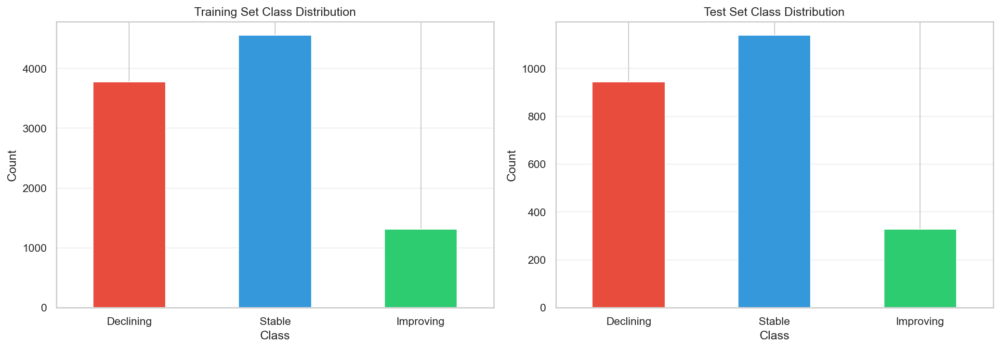

# Appendix A — Model Results Summary

## 1. Performance Evolution

| Phase | Dataset | Model | Accuracy | ROC-AUC | Macro F1 | Improving F1 |
| :--- | :--- | :--- | :--- | :--- | :--- | :--- |
| Baseline | `data/trajectory_excellent.csv` | Majority Class | 0.464 | – | 0.211 | 0.000 |
| Linear | `data/trajectory_excellent.csv` | Logistic Regression + SMOTE | 0.546 | 0.653 | 0.436 | 0.234 |
| Ensemble | `data/trajectory_excellent.csv` | Random Forest + SMOTE | 0.880 | 0.968 | 0.829 | 0.655 |
| **Final** | `data/trajectory_excellent.csv` | **XGBoost + SMOTE** | **0.876** | **0.968** | **0.827** | **0.658** |

**Total Improvement:** +41% accuracy over majority baseline, +0.62 Macro-F1.

---

## 2. Baseline Comparison (Advanced Dataset)

| Model | Accuracy | ROC-AUC | Macro F1 | Declining F1 | Stable F1 | Improving F1 |
| :--- | :--- | :--- | :--- | :--- | :--- | :--- |
| XGBoost (SMOTE) | 0.554 | 0.765 | 0.516 | 0.441 | 0.675 | 0.433 |
| Majority Class | 0.472 | – | 0.214 | 0.000 | 0.642 | 0.000 |
| Random Guess | 0.320 | – | 0.303 | 0.348 | 0.367 | 0.195 |

The ML pipeline adds +8.2 accuracy points and +0.20 macro-F1 over heuristics.

---

## 3. Excellent Dataset Results

### Feature Highlights (52 total features)
- **Temporal persistence:** `Lag1_Target_Label`, `Same_Trajectory_As_Lag`, `Trajectory_Changed`
- **Efficiency metrics:** `Revenue_Expense_Ratio`, `Efficiency_Momentum`, `Revenue_Expense_Ratio_Change`
- **Per-athlete metrics:** `Revenue_Per_Athlete`, `Expense_Per_Athlete` (current and lagged)
- **Growth momentum:** `Revenue_Growth_Momentum`, `Expense_Growth_Momentum`
- **Volatility trends:** `Revenue_Volatility_Change`, `Expense_Volatility_Change`

### Final Model Performance (Nov 27, 2025 Run)

| Model | Accuracy | ROC-AUC | Macro F1 | Declining F1 | Stable F1 | Improving F1 |
| :--- | :--- | :--- | :--- | :--- | :--- | :--- |
| Majority Class | 0.464 | – | 0.211 | 0.000 | 0.634 | 0.000 |
| Logistic Regression + SMOTE | 0.546 | 0.653 | 0.436 | 0.400 | 0.680 | 0.234 |
| Random Forest + SMOTE | 0.880 | 0.968 | 0.829 | 0.920 | 0.910 | 0.655 |
| **XGBoost + SMOTE** | **0.876** | **0.968** | **0.827** | **0.916** | **0.907** | **0.658** |

---

## 4. Final Model Configuration

**XGBoost + SMOTE Pipeline:**
- `n_estimators=600`, `max_depth=4`, `learning_rate=0.03`
- `subsample=0.9`, `colsample_bytree=0.9`, `min_child_weight=2`
- `gamma=0.1`, `reg_lambda=1.0`, `reg_alpha=0.1`
- SMOTE applied within pipeline (random_state=42)

**Random Forest + SMOTE (comparable performance):**
- `n_estimators=400`, `max_depth=None`, `min_samples_leaf=2`

---

## 5. Key Insights

1. **Efficiency momentum drives predictions.** Schools improving their revenue-to-expense ratio rarely flag as Declining.
2. **Division context is critical.** NCAA division dummies act as structural priors.
3. **Gender allocation is predictive.** Large imbalances correlate with elevated Declining risk.
4. **Per-athlete spend matters.** The model rewards disciplined allocation over raw totals.

---

## 6. Visualizations

### 6.1 Class Distribution

*Figure A1: Dataset exhibits moderate class imbalance, addressed via SMOTE oversampling during training.*

### 6.2 Feature Importance by Category

*Figure A2: Aggregated feature importance shows Revenue and Efficiency categories contribute most to predictions.*
